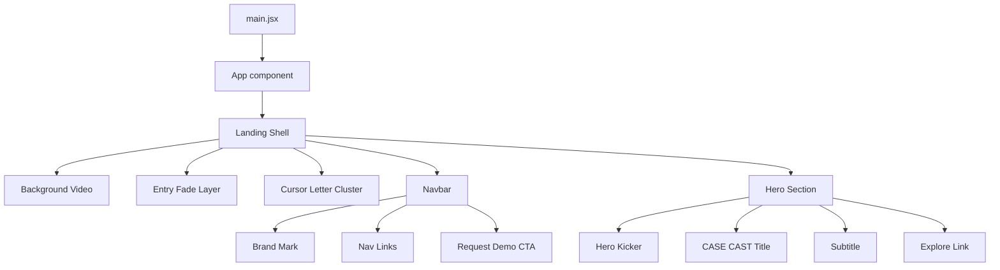
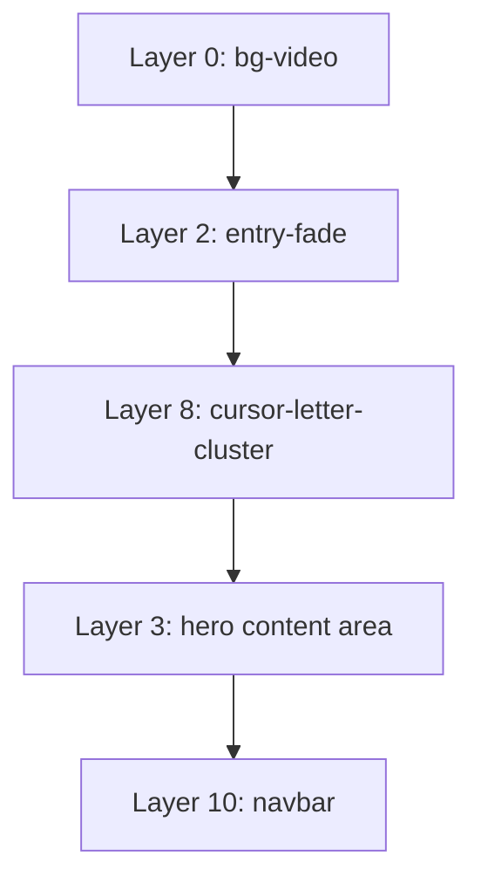
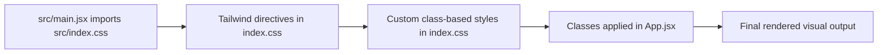
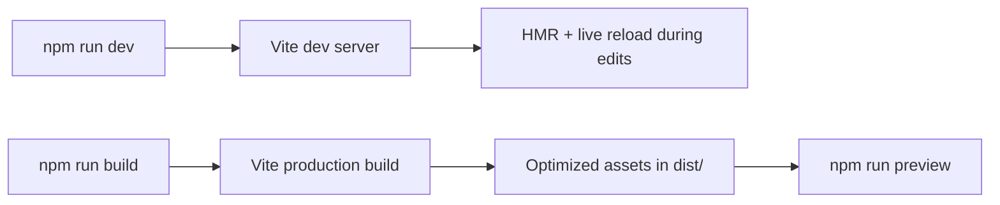
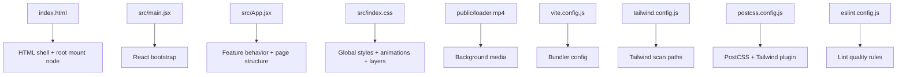

# CaseCast Frontend - Architecture Diagrams (Demo/Interview Revision)

This file is a quick visual revision sheet for:
- Request flow
- Component flow
- Layering flow
- Build/runtime flow

## 1) Request Flow (User -> Screen)

```mermaid
flowchart LR
    A[User opens site] --> B[index.html loaded]
    B --> C[src/main.jsx executes]
    C --> D[React createRoot mounts App]
    D --> E[src/App.jsx renders landing UI]
    E --> F[Video source /loader.mp4 requested]
    F --> G[Video can play event]
    G --> H[videoReady=true]
    H --> I[entry fade overlay hidden]
    I --> J[Interactive landing visible]
```

How to explain in interviews:
1. Browser gets HTML shell.
2. React bootstraps in main.jsx.
3. App.jsx renders full landing stack.
4. Video readiness triggers smooth reveal.

## 2) Component Flow (React Tree)

State + hooks used:
- videoReady (useState): controls fade reveal after video readiness
- cursor state (useState): tracks mouse x/y and active hover state
- clusterLetters (useMemo): precomputed animated letter positions/settings

## 3) Layering Flow (Z-Index Stack)

Note:
- The visual order is controlled by absolute/fixed positioning + z-index in src/index.css.
- Cursor letters are pointer-events: none, so they never block user interaction.

## 4) Styling Flow (Where CSS Comes From)

Tailwind pipeline files:
- tailwind.config.js (content scanning)
- postcss.config.js (Tailwind plugin hookup)
- src/index.css (@tailwind base/components/utilities)

Practical note:
- In the current landing page, most styling is custom CSS classes, not utility-only Tailwind classes.

## 5) Build and Runtime Flow

## 6) File Responsibility Map

## 7) 30-Second Demo Script

Use this if interviewer asks: "Walk me through architecture quickly."

1. Vite serves index.html and mounts React via main.jsx.
2. App.jsx is the landing orchestrator: video background, navbar, hero, and cursor letter interaction.
3. A videoReady state controls fade-in timing so first paint feels deliberate.
4. Cursor movement updates CSS-variable-driven letter cluster animation.
5. index.css owns all layers and animation rules; Tailwind is configured but current page is mostly custom CSS.
6. Build pipeline is standard Vite: dev for HMR, build for dist optimization.

## 8) Interview Deep-Dive Points

If asked "why this design":
- Separation of concerns:
  - structure/behavior in App.jsx
  - visuals/animation in index.css
- Performance-minded choices:
  - useMemo for cluster metadata
  - lightweight state model
  - pointer-events disabled on decorative layer
- Maintainability:
  - clear class names
  - predictable z-index architecture

## 9) Quick Revision Checklist

Before demos/interviews, revise:
- Entry point chain: index.html -> main.jsx -> App.jsx
- State logic: videoReady and cursor
- Layering order and why z-index values matter
- Tailwind presence vs actual custom CSS usage
- What lives in public versus src
